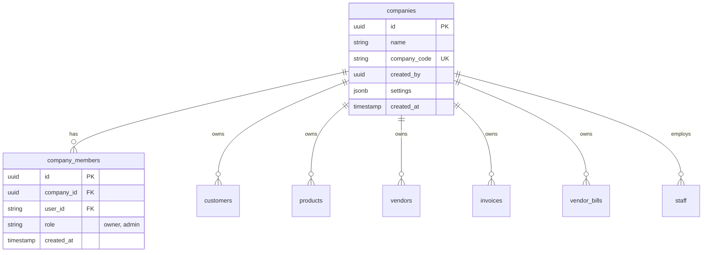
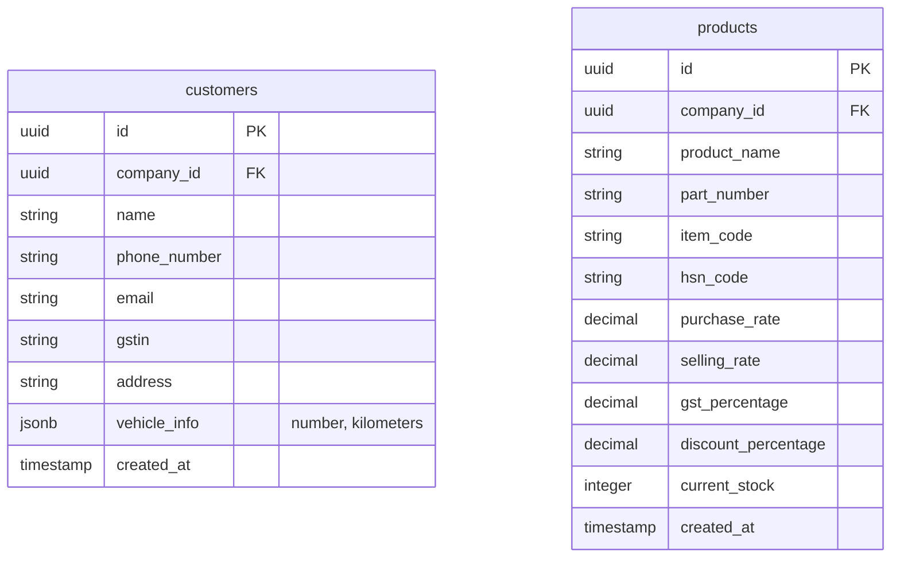
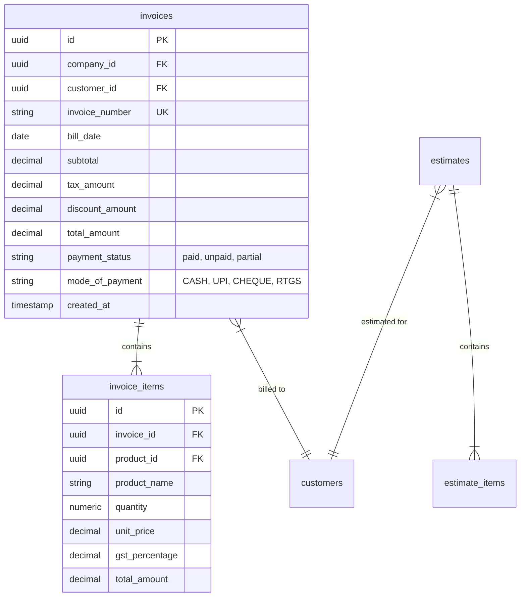
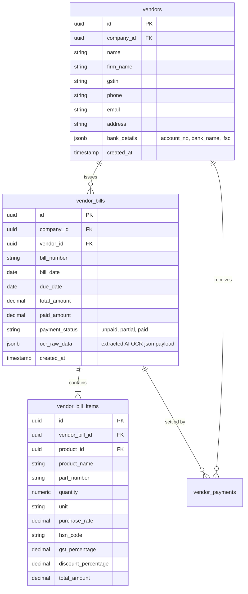
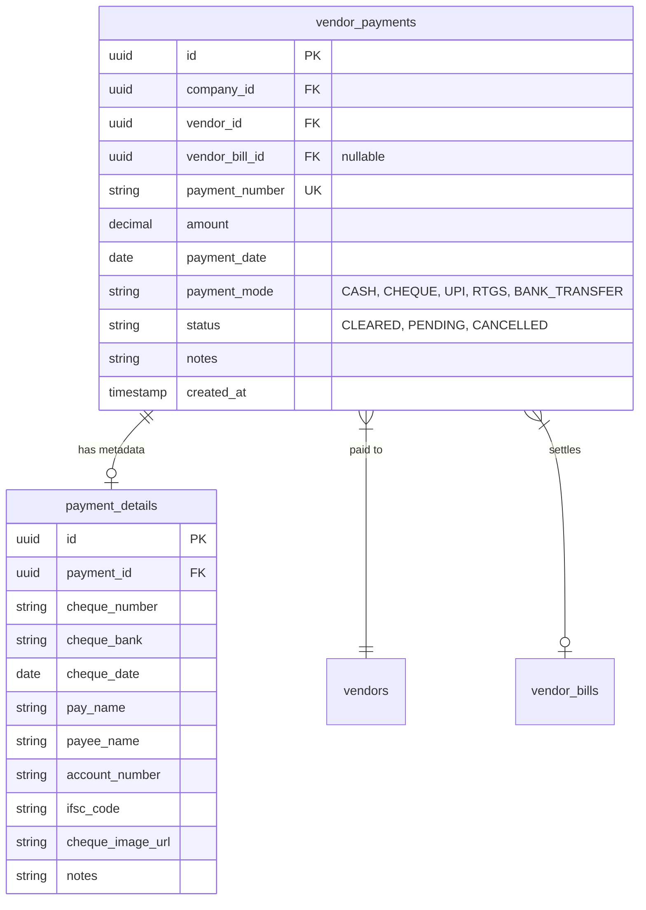
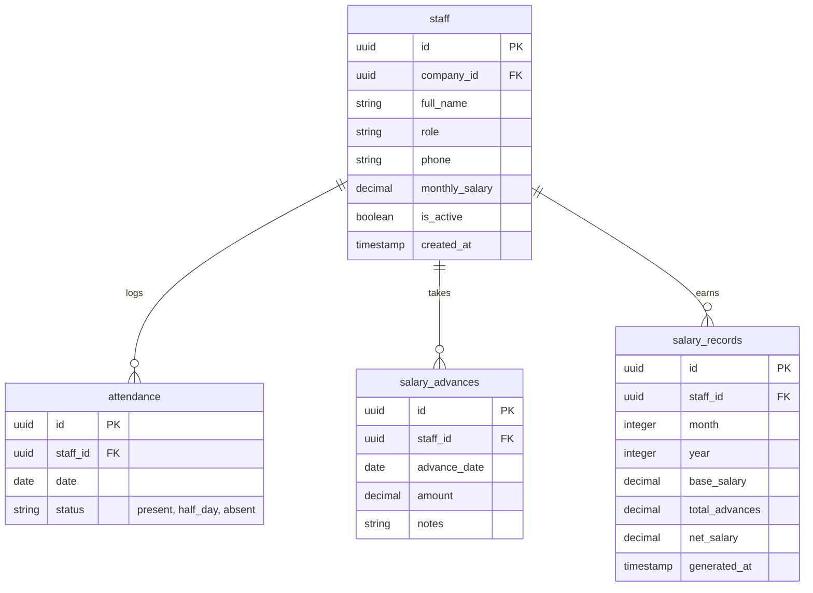

Database Schema & Architecture - HisabKitab

This document outlines the complete PostgreSQL database schema for the HisabKitab application, hosted on Supabase. It details the multi-company tenant architecture, table structures, foreign keys, indexing strategies, and Row Level Security (RLS) policies across billing, inventory, vendor management, cheque payments, HR/staffing, and cash flow ledgers.

---

1. Multi-Company & Workspace Core
The foundation of the architecture is a multi-company structure where users can own or administer multiple companies. Every tenant's operational data is isolated by `company_id`.



- `companies`: Central tenant table. Each operating business receives a unique `company_code`.
- `company_members`: Cross-reference table mapping platform users to authorized companies and their administrative roles (`owner`, `admin`).
- Every operational table across the database (e.g., `invoices`, `customers`, `vendors`, `vendor_bills`, `staff`) maintains a `company_id` foreign key referencing the `companies` table. Row Level Security (RLS) policies strictly enforce tenant-level isolation.

---

2. Customer & Inventory Modules



- `customers`: Stores client profiles including GSTIN, contact data, and custom vehicle metadata (e.g., vehicle number, kilometers driven for automotive/service businesses).
- `products`: Master product catalog and live inventory ledger. Tracks `current_stock`, pricing (`purchase_rate`, `selling_rate`, `discount_percentage`), and tax rules (`gst_percentage`, `hsn_code`). Stock is automatically decremented during sales invoice creation and incremented upon vendor bill confirmation.

---

3. Billing & Estimates (Accounts Receivable)



- `invoices` & `estimates`: Financial transaction headers tracking totals, payment statuses, and tax breakdowns. Safe sequential numbering is guaranteed via an atomic counter lock mechanism (`invoice_counter`).
- `invoice_items` & `estimate_items`: Line-item tables mapping specific products, quantities, tax rates, and subtotal revenues.

---

4. Vendor & Purchases Module (Accounts Payable)



- `vendors`: Directory of suppliers and vendors. Scoped per tenant using `company_id (FK -> companies.id)`. Index `idx_vendors_company_id` speeds up vendor lookups.
- `vendor_bills`: Inbound purchasing bills (captured manually or automatically via AI Bill OCR Scanner). Tracks total amount, paid amount, and payment status (`unpaid`, `partial`, `paid`). Stores raw OCR JSON payloads in `ocr_raw_data` for auditability.
- `vendor_bill_items`: Itemized lines from supplier bills. When a scanned or manual bill is saved, the application executes atomic updates to synchronize `vendor_bill_items` directly into `products.current_stock` (incrementing stock) and updating master `products.purchase_rate`.

---

5. Vendor Payments Ledger & Cheque OCR Details



- `vendor_payments`: Master ledger for outward cash flows to suppliers. Payments can be linked to a specific `vendor_bill_id` or applied directly to the vendor's running account balance.
- `payment_details`: One-to-one detail extension storing bank cheque metadata extracted directly via the AI Cheque Scanner (`/api/scan-check`) or banking transaction references (RTGS/NEFT IDs).

---

6. Staffing & HR Module



- `staff`: Employee records tied to `company_id`.
- `attendance` & `salary_advances`: Operational logs tracking daily presence and cash advance loans deducted during payroll processing.
- `salary_records`: Monthly payroll calculations factoring working days, absences, base salaries, and advances into a finalized `net_salary` for automated PDF slip generation.

---

7. Security (Row Level Security & Helper Functions)

Database functions and RLS policies guarantee strict multi-tenant isolation:

```sql
-- Helper function to verify company access
CREATE OR REPLACE FUNCTION user_has_company_access(p_company_id UUID)
RETURNS BOOLEAN AS $$
BEGIN
  RETURN EXISTS (
    SELECT 1 FROM company_members
    WHERE company_id = p_company_id
    AND user_id = auth.uid()::text
  );
END;
$$ LANGUAGE plpgsql SECURITY DEFINER;

-- Universal Row Level Security Policy Template
CREATE POLICY "Tenant company isolation policy"
ON vendors
FOR ALL
USING (company_id IS NULL OR user_has_company_access(company_id));
```